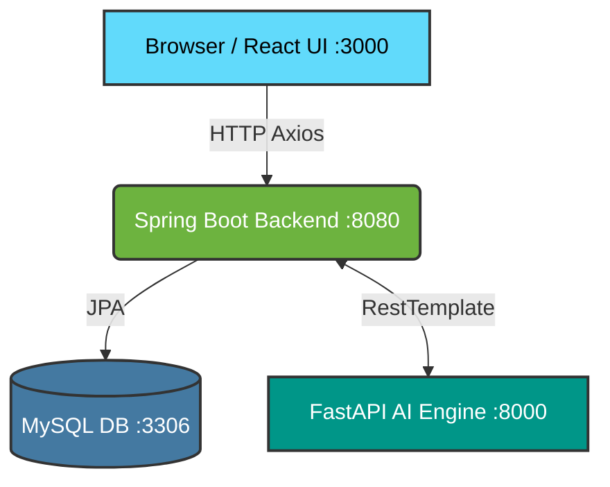

<div align="center">
  <h1>🌱 Carbon Credit Trading Platform</h1>
  <p><strong>A full-stack enterprise application for role-based carbon emission reporting, AI verification, and P2P credit trading.</strong></p>

  <p>
    
    
    
    
    
  </p>
</div>

---

## 📖 Overview

The **Carbon Credit Trading Platform** enables companies to register, submit CO₂ emission reports (verified by an AI engine), receive carbon scores, and trade carbon credits securely in a peer-to-peer marketplace. 

With the introduction of **Version 2.0.0**, the platform now features an advanced **AI Intelligence Suite** to predict emissions, recommend dynamic credit pricing, and detect suspicious transactions.

---

## ✨ Key Features

### 🏢 Core Platform
- **Role-Based Access Control**: Secure access for Admins, Sellers, and Buyers.
- **Emission Reporting**: Submit company CO₂ emissions for automated AI verification.
- **Marketplace & Trading**: Peer-to-peer carbon credit transfer and trading.
- **Admin Dashboard**: Comprehensive company registry and credit assignment system.
- **Transaction History**: Track all trades with role-filtered visibility.

### 🤖 AI Intelligence Suite (v2.0)
- **📈 Carbon Emission Prediction**: Forecasts future CO₂ output using Linear Regression and suggests reduction strategies.
- **💰 Dynamic Price Recommendation**: Calculates optimal market prices based on real-time supply, demand, and carbon scores.
- **🕵️ Suspicious Transaction Detection**: Uses Isolation Forest anomaly detection combined with rule-based flags to identify fraudulent high-volume or high-frequency trades.

*(Note: The application includes offline fallbacks, ensuring continuous operation even if the AI engine is temporarily unavailable.)*

---

## 🏗️ System Architecture



---

## 🚀 Getting Started

Follow these instructions to get the platform up and running on your local machine.

### Prerequisites
- **Java 17+** & Maven 3.8+
- **Python 3.9+** & pip
- **Node.js 18+** & npm
- **MySQL 8.0**

### 1️⃣ Database Setup
Create the database in MySQL:
```sql
CREATE DATABASE IF NOT EXISTS carbon_db;
```
> **Note:** Update the database credentials in `carbon-credit-platform/src/main/resources/application.properties`.

### 2️⃣ Start the AI Engine (FastAPI)
```bash
cd ai-engine
python -m venv venv

# Windows
venv\Scripts\activate
# Mac/Linux
source venv/bin/activate

pip install -r requirements.txt
uvicorn main:app --reload --port 8000
```
*API Docs available at: http://localhost:8000/docs*

### 3️⃣ Start the Backend (Spring Boot)
Open a new terminal:
```bash
cd carbon-credit-platform
./mvnw spring-boot:run
```
*Backend running on: http://localhost:8080*

### 4️⃣ Start the Frontend (React)
Open a new terminal:
```bash
cd frontend-ui
npm install
npm start
```
*App running on: http://localhost:3000*

---

## 🔌 API Endpoints Reference

### 🧠 AI Endpoints (FastAPI & Spring Boot)
| Feature | Endpoint | Method |
|---------|----------|--------|
| **Predict Emissions** | `/ai/predict` | `POST` |
| **Recommend Price** | `/ai/price` | `GET` |
| **Detect Anomaly (Single)** | `/ai/detect` | `POST` |
| **Bulk Scan (Admin)** | `/ai/detect/all` | `GET` |

### 🛠️ Core Endpoints
- **Auth**: `/auth/register`, `/auth/login`
- **Company**: `/company/{id}`
- **Emissions**: `/emissions/submit`
- **Admin**: `/admin/companies`, `/admin/assignCredits`, `/admin/sellCredits`
- **Trading**: `/trading/transfer`, `/trading/history`

---

## 🔮 Future Roadmap
- [ ] Upgrade emission prediction to ARIMA/SARIMA for seasonal tracking.
- [ ] Implement federated learning for personalized, per-company emission models.
- [ ] Integrate a real-time charting library for dynamic transaction monitoring.
- [ ] Generate EU ETS / ICAP-compliant regulatory reports.

---
<div align="center">
  <p>Built with ❤️ for a Greener Future</p>
</div>
