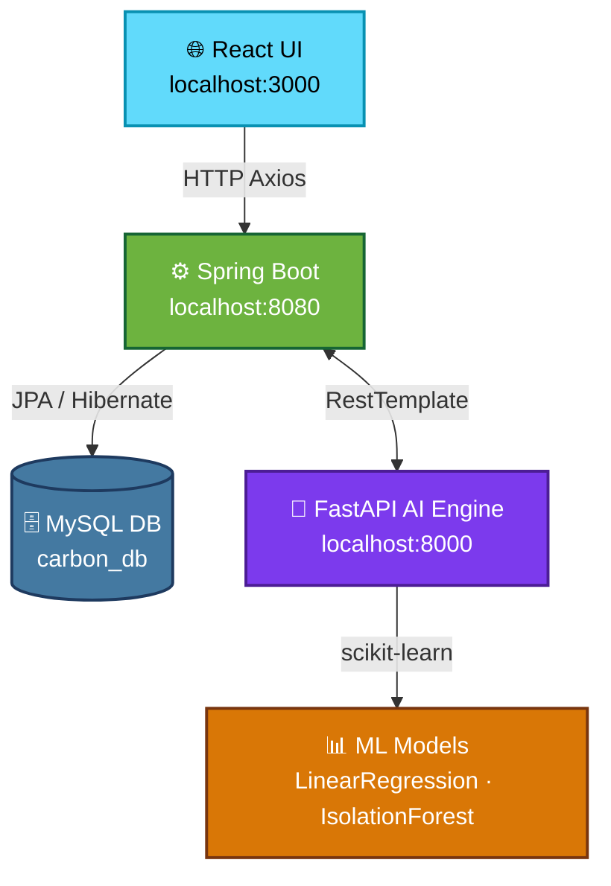

<div align="center">


<br/>

<p>
  <strong>A full-stack enterprise platform for carbon emission reporting, AI-powered verification, and secure peer-to-peer carbon credit trading.</strong>
</p>

<br/>

<p>
  
  
  
  
  
  
</p>

<p>
  
  
  
  
</p>

</div>

---

## 📖 Overview

The **Carbon Credit Trading Platform** is a production-grade, enterprise-level application that empowers companies to participate in a transparent and intelligent carbon credit ecosystem. Companies can register, submit CO₂ emission reports, receive AI-verified carbon scores, and trade credits securely in a peer-to-peer marketplace.

> **Version 2.0** introduces a full **AI Intelligence Suite** — predicting future emissions, recommending dynamic credit pricing, and detecting suspicious transactions using machine learning.

---

## ✨ Features at a Glance

<table>
  <tr>
    <td>
      <h3>🏢 Core Platform</h3>
      <ul>
        <li>🔐 <strong>Role-Based Access Control</strong> — Admin, Seller, Buyer roles</li>
        <li>📊 <strong>Emission Reporting</strong> — Submit CO₂ data for AI verification</li>
        <li>🤝 <strong>P2P Carbon Marketplace</strong> — Secure credit transfers between companies</li>
        <li>🛡️ <strong>JWT Authentication</strong> — Stateless, token-based security</li>
        <li>📋 <strong>Admin Dashboard</strong> — Company registry and credit assignment</li>
        <li>📜 <strong>Transaction History</strong> — Role-filtered trade audit trail</li>
      </ul>
    </td>
    <td>
      <h3>🤖 AI Intelligence Suite (v2.0)</h3>
      <ul>
        <li>📈 <strong>Emission Prediction</strong> — Linear Regression forecasts future CO₂ output</li>
        <li>💰 <strong>Dynamic Pricing</strong> — Real-time price recommendations based on supply and demand</li>
        <li>🕵️ <strong>Fraud Detection</strong> — Isolation Forest anomaly detection for suspicious trades</li>
        <li>✅ <strong>Emission Verification</strong> — Automated carbon score assignment</li>
        <li>🔌 <strong>Offline Fallback</strong> — Platform operates even if AI engine is down</li>
      </ul>
    </td>
  </tr>
</table>

---

## 🏗️ System Architecture

```
┌─────────────────────────────────────────────────────────┐
│                                                         │
│   🌐  React Frontend   (Port 3000)                      │
│        Axios · Recharts · JWT decode                    │
│                      │                                  │
│                       ▼  HTTP / REST API                │
│   ⚙️  Spring Boot Backend   (Port 8080)                 │
│        JPA · Hibernate · Tomcat · JWT Security          │
│         │                          │                    │
│         ▼                          ▼                    │
│  🗄️  MySQL Database          🤖  FastAPI AI Engine       │
│     (Port 3306)                 (Port 8000)             │
│    carbon_db                   /verify · /predict       │
│                                /price  · /detect        │
│                                                         │
└─────────────────────────────────────────────────────────┘
```



---

## 🚀 Getting Started

### Prerequisites

| Tool | Required Version |
|------|-----------------|
| ☕ Java (JDK) | 17 or higher |
| 📦 Maven | 3.8+ |
| 🐍 Python | 3.9+ |
| 🟢 Node.js | 18+ |
| 🐬 MySQL | 8.0 |

---

### 1️⃣ Database Setup

Create the database in MySQL:

```sql
CREATE DATABASE IF NOT EXISTS carbon_db;
```

Update the credentials in `carbon-credit-platform/src/main/resources/application.properties`:

```properties
spring.datasource.url=jdbc:mysql://localhost:3306/carbon_db
spring.datasource.username=YOUR_MYSQL_USERNAME
spring.datasource.password=YOUR_MYSQL_PASSWORD
spring.jpa.hibernate.ddl-auto=update
server.port=8080
```

> ⚠️ **Never commit your real credentials.** Use environment variables or a secrets manager in production.

---

### 2️⃣ Start the AI Engine (FastAPI)

```bash
cd ai-engine

# Create a virtual environment (recommended)
python -m venv venv

# Activate — Windows
venv\Scripts\activate
# Activate — Mac/Linux
source venv/bin/activate

# Install dependencies
pip install -r requirements.txt

# Start the server
uvicorn main:app --reload --port 8000
```

✅ AI Engine running at **http://localhost:8000**
📚 Interactive API docs at **http://localhost:8000/docs**

---

### 3️⃣ Start the Backend (Spring Boot)

```bash
cd carbon-credit-platform
./mvnw spring-boot:run
```

✅ Backend running at **http://localhost:8080**

---

### 4️⃣ Start the Frontend (React)

```bash
cd frontend-ui
npm install
npm start
```

✅ App running at **http://localhost:3000**

---

## 🔌 API Reference

### 🧠 AI Endpoints (FastAPI — port 8000)

| Endpoint | Method | Description |
|----------|--------|-------------|
| `/verify` | `POST` | Verify emission and assign carbon score |
| `/predict` | `POST` | Predict future CO₂ emissions (Linear Regression) |
| `/price` | `POST` | Get dynamic credit price recommendation |
| `/detect` | `POST` | Detect suspicious transaction (Isolation Forest) |

### ⚙️ Core Spring Boot Endpoints (port 8080)

| Category | Endpoint | Method | Access |
|----------|----------|--------|--------|
| **Auth** | `/auth/register` | `POST` | Public |
| **Auth** | `/auth/login` | `POST` | Public |
| **Company** | `/company/{id}` | `GET` | Authenticated |
| **Emissions** | `/emissions/submit` | `POST` | Seller/Buyer |
| **Admin** | `/admin/companies` | `GET` | Admin only |
| **Admin** | `/admin/assignCredits` | `POST` | Admin only |
| **Trading** | `/trading/transfer` | `POST` | Seller/Buyer |
| **Trading** | `/trading/history` | `GET` | Authenticated |
| **AI Proxy** | `/ai/predict` | `POST` | Authenticated |
| **AI Proxy** | `/ai/price` | `GET` | Authenticated |
| **AI Proxy** | `/ai/detect` | `POST` | Authenticated |
| **AI Proxy** | `/ai/detect/all` | `GET` | Admin only |

---

## 👥 User Roles

| Role | Capabilities |
|------|-------------|
| 🛡️ **ADMIN** | Manage all companies, assign/revoke credits, view all transactions, run bulk fraud detection |
| 🏭 **SELLER** | Submit emission reports, sell carbon credits, view own transaction history |
| 🛒 **BUYER** | Purchase carbon credits, view marketplace, view own transaction history |

> **Note:** Admin accounts can only be created directly in the database. The `/auth/register` endpoint is restricted to `SELLER` and `BUYER` roles only.

---

## 🗂️ Project Structure

```
Carbon-credit-platform/
│
├── 📁 ai-engine/                   # FastAPI Python AI microservice
│   ├── main.py                     # All AI endpoints (verify, predict, price, detect)
│   └── requirements.txt            # Python dependencies
│
├── 📁 carbon-credit-platform/      # Spring Boot Java backend
│   ├── src/main/java/com/carbon/
│   │   ├── controller/             # REST controllers (Auth, Admin, Trading, AI, ...)
│   │   ├── entity/                 # JPA entities (Company, EmissionReport, Transaction)
│   │   ├── repository/             # Spring Data JPA repositories
│   │   ├── service/                # Business logic services
│   │   ├── security/               # JWT utility and filters
│   │   └── config/                 # CORS and security configuration
│   └── src/main/resources/
│       └── application.properties  # DB and server config (DO NOT commit credentials)
│
├── 📁 frontend-ui/                  # React.js frontend
│   ├── src/
│   │   ├── App.js                  # Main app with routing and all views
│   │   ├── App.css                 # Global styles
│   │   └── components/             # Reusable UI components
│   └── package.json
│
├── 📁 docker/                       # Docker support files
├── docker-compose.yml              # Multi-service Docker orchestration
├── .gitignore                      # Excludes secrets, node_modules, build artifacts
└── README.md
```

---

## 🐳 Docker Deployment

To run the entire stack with Docker Compose:

```bash
# Build and start all services
docker-compose up --build

# Stop all services
docker-compose down
```

Services started automatically:
- 🌐 React Frontend → `http://localhost:3000`
- ⚙️ Spring Boot → `http://localhost:8080`
- 🤖 FastAPI AI → `http://localhost:8000`
- 🗄️ MySQL → `localhost:3306`

---

## 🔮 Roadmap

- [ ] Upgrade emission prediction to **ARIMA/SARIMA** for seasonal tracking
- [ ] Implement **federated learning** for personalized per-company emission models
- [ ] Integrate **real-time charting** (WebSocket) for live transaction monitoring
- [ ] Generate **EU ETS / ICAP-compliant** regulatory PDF reports
- [ ] Add **password hashing** (BCrypt) for production-ready security
- [ ] **Email notifications** for trade confirmations and fraud alerts

---

## 🤝 Contributing

Contributions are welcome! Here is how:

1. **Fork** the repository
2. Create a feature branch: `git checkout -b feature/amazing-feature`
3. Commit your changes: `git commit -m 'feat: add amazing feature'`
4. Push to the branch: `git push origin feature/amazing-feature`
5. Open a **Pull Request**

---

## 📄 License

This project is licensed under the **MIT License** — see the [LICENSE](LICENSE) file for details.

---

<div align="center">

**Built with ❤️ for a Greener Future 🌍**

<br/>


<br/><br/>

⭐ **Star this repo if you found it useful!** ⭐

</div>
